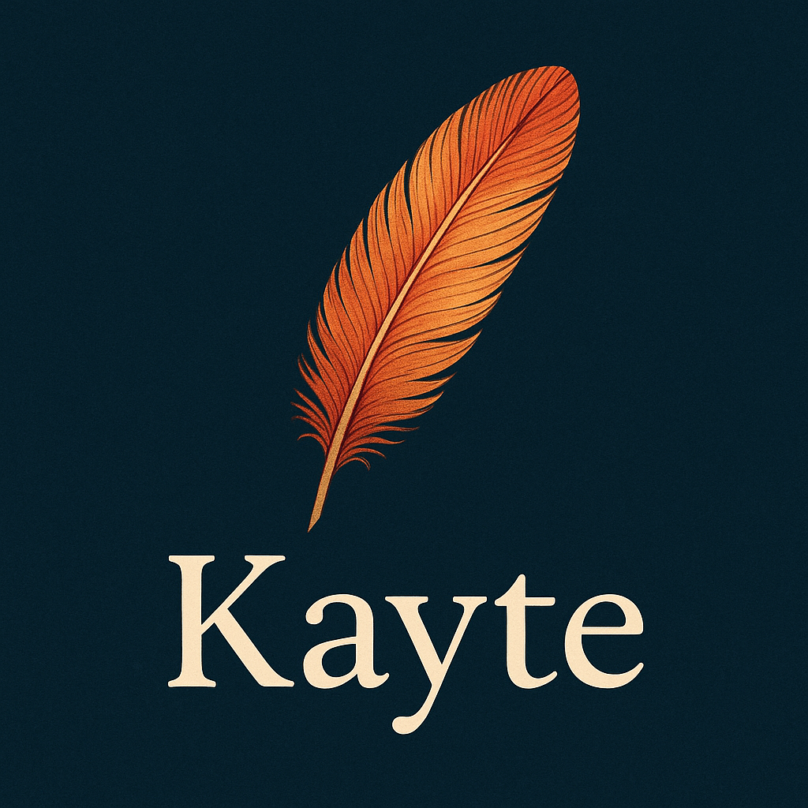

# KayteIDE



KayteIDE is a cross-platform Integrated Development Environment built with **Qt 6 and C++17**. It supports editing and running projects in the Kayte language, C++, Pascal/Delphi, and Visual Basic, with an optional RAD (Rapid Application Development) mode for designing UI forms visually.

-----

## Features

* **Multi-language editing**
    * Syntax highlighting for Kayte, C++, Pascal, Delphi, and Visual Basic.
    * Tabbed editor with line numbers and a built-in terminal dock.
* **Project management**
    * New Project dialog, a project tree panel, and workspace-relative file browsing.
    * `.xproj` project scaffolding.
* **RAD mode**
    * A drag-and-drop widget palette, a design canvas, and component/property editor docks for building UI forms, saved as XML (see `plugins/libreparser/ui/ui.dtd`).
    * Forms can also be opened and edited standalone with the `libreparser` plugin.
* **Version control**
    * Built-in Git and Subversion panels (dockable), with working-directory sync tied to the active project.
* **Unit testing**
    * An embedded multi-language test runner (`plugins/unit_test`) with its own syntax highlighting and process management.
* **Auto-updater**
    * `KayteIDEUpdater` is built alongside KayteIDE and launchable from **Tools > Updater…** to check for and build updates.
* **Packaging**
    * macOS: signed `.app` bundle plus a `.dmg` installer, built automatically.
    * Linux: `.deb` and `.rpm` packages via CPack.

-----

## Supported Platforms

KayteIDE officially supports building and running on:

* **macOS** (Intel and Apple Silicon)
* **Linux** (x86_64 and arm64, anywhere Qt 6 is available)

Windows is not currently a supported build target.

-----

## Getting Started

### Prerequisites

* **Git** — for cloning the repository.
* **CMake** — version 3.16 or higher.
* **A C++17 compiler** — GCC or Clang.
* **Qt 6 (6.2+)** development libraries, with the `Core`, `Gui`, `Widgets`, `Concurrent`, `Network`, and `WebEngineWidgets` modules:
    * **macOS**: `brew install qt@6`, then point CMake at it, e.g. `export CMAKE_PREFIX_PATH="$(brew --prefix qt6)"`.
    * **Linux**: install your distribution's Qt 6 dev packages, e.g. `sudo apt install qt6-base-dev qt6-webengine-dev` (Debian/Ubuntu) or `sudo dnf install qt6-qtbase-devel qt6-qtwebengine-devel` (Fedora).
* **libgit2** — used if found via pkg-config; otherwise CMake fetches and builds it automatically.
* **Subversion** (optional) — used natively via `libsvn` if found, otherwise KayteIDE falls back to shelling out to the `svn` CLI.
* **GTK4** (optional) — if present (via pkg-config), the `libreparser` plugin additionally builds a GTK4 UI alongside its default Qt6 one.

### Building

```bash
git clone https://github.com/ringsce/kayteide.git
cd kayteide
mkdir build && cd build
cmake ..
cmake --build . --parallel
```

This builds the `KayteIDE` and `KayteIDEUpdater` targets. On macOS it also produces a `KayteIDE-Installer.dmg` in `build/bin/`; on Linux, run `cpack -G DEB` or `cpack -G RPM` from the build directory to produce a package.

### Running

* **macOS**: `open build/bin/KayteIDE.app`
* **Linux**: `./build/bin/KayteIDE`

-----

## Usage

1. **First launch**: choose **Text Editor** or **RAD** mode. KayteIDE checks for required tools (git, cmake, make — installing Homebrew and missing tools on macOS if needed) before fetching the mode's starter repositories.
2. **File > New Project / Open / Save**: standard file and project workflows.
3. **Tools menu**: toggle the Git and Subversion panels, set the shared VCS working directory, launch the updater, or view keyboard shortcuts.
4. **RAD mode**: use the widget palette and canvas to lay out a form, then inspect/edit components in the Components and Property editor docks.
5. **Build / Run / Clean / Debug**: available from the Project menu and toolbar.

-----

## Plugins

* **`plugins/project`** — the New Project dialog (Qt6), with a standalone GTK4-based mirror (`project_dialog`) buildable independently for testing.
* **`plugins/libreparser`** — a standalone XML/UI form editor. Builds with Qt6 by default (KDE, macOS); additionally builds a GTK4 UI, gated behind `KAYTE_GTK4_ENABLED`, when GTK4 is available on Linux or macOS.
* **`plugins/unit_test`** — the multi-language test runner embedded in the main IDE.

-----

## Customization and Development

* **Syntax highlighting**: `src/*syntaxhighlighter.{h,cpp}` — one file per language (Kayte, C++, Pascal, Delphi, Visual Basic).
* **UI layout**: `src/mainwindow.ui`, editable with Qt Designer.
* **Icons**: managed via `resources/main_resources.qrc` and `resources/icons/`.
* **Continuous integration**: `Jenkinsfile` builds a universal macOS app plus Linux arm64/amd64 artifacts — see the comments at the top of the file for the pipeline layout.

-----

## Contributing

Contributions are welcome! If you have suggestions for improvements or run into issues, please open an issue or submit a pull request.

-----

## License

This project is licensed under the **GNU General Public License v3.0**. See [LICENSE](LICENSE) for the full text.

-----

## Contact

**Pedro Dias Vicente** — [pdvicente@gleentech.com](mailto:pdvicente@gleentech.com)

Project Link: [https://github.com/ringsce/kayteide](https://github.com/ringsce/kayteide)
